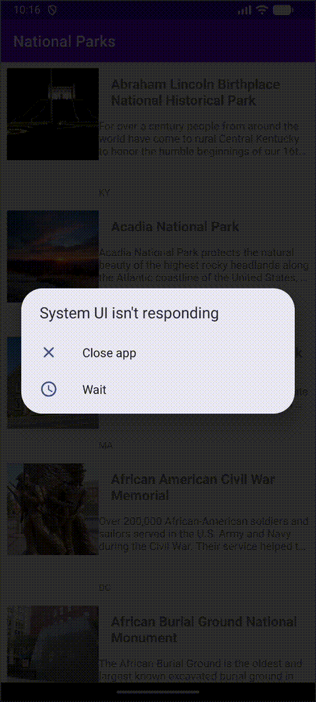

# CS388 Lab 3 - National Parks App

An Android application that displays national parks data from the National Parks Service API.

## Features

- Displays a list of national parks with images
- Shows park name, description, and location
- Uses RecyclerView for efficient list rendering
- Fetches data from the National Parks API using AsyncHttpClient
- Loads images using Glide library

## Demo

## Technical Details

- **Language**: Kotlin
- **Minimum SDK**: 21
- **Target SDK**: 34
- **Compile SDK**: 36

## Dependencies

- CodePath AsyncHttpClient for network requests
- Gson for JSON parsing
- Glide for image loading
- Material Design components

